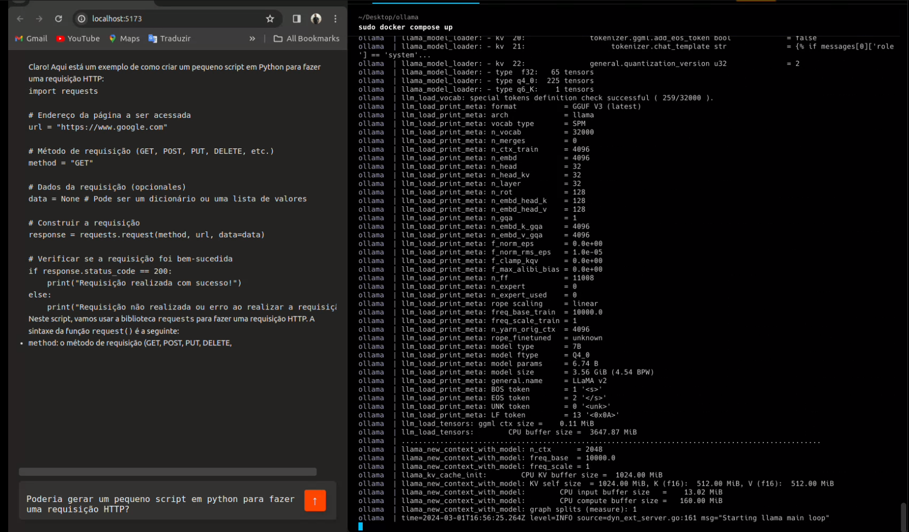

# OllamaBot 🤖



O **OllamaBot** é uma aplicação inovadora que utiliza a imagem de contêiner Llama para implementar um assistente de conversação inteligente, semelhante ao GPT (Generative Pre-trained Transformer)

O **OllamaBot** é capaz de compreender e gerar respostas coerentes em uma variedade de contextos, proporcionando uma experiência de interação natural e eficaz.

## Recursos Principais

* **Inteligência Artificial Avançada**: Baseado na tecnologia de modelos de linguagem pré-treinados, o OllamaBot é capaz de compreender nuances na linguagem humana e gerar respostas relevantes e contextuais.

* **Aprendizado Contínuo**: O **OllamaBot** pode ser treinado continuamente com novos dados e feedback do usuário, aprimorando sua capacidade de compreensão e geração de respostas ao longo do tempo.

## Configuração do Ambiente

#### 1. Clone o repositório:
```sh
git clone https://github.com/manuelbento19/ollama-bot.git
```
***Att**: Certifique-se de ter o Docker e o Docker Compose instalados em seu sistema.*

#### 2. Dê permissões de execução no script:
  ```sh
  chmod +x ./setup.sh
  ```
#### 3. Execute o script para iniciar o chatbot:
  ```sh
  sudo ./setup.sh
  ```

🎊 O chatbot estará pronto para interagir assim que estiver em execução.

## Interagindo com o **OllamaBot**

- Faça perguntas ou forneça informações ao **OllamaBot** e aguarde suas respostas.
- Experimente diferentes tipos de consultas e observe como o **OllamaBot** responde de forma inteligente e coerente.

## Contribuição

Contribuições para o aprimoramento do **OllamaBot** são bem-vindas! Sinta-se à vontade para abrir Issues ou enviar pull requests.